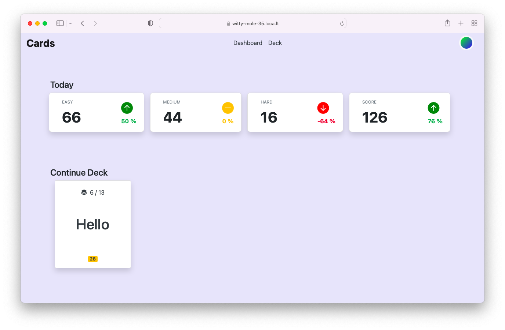

# Cards &middot; [](https://github.com/flxhq/cards.flask/actions/workflows/codeql.yml)

This repository holds Python, HTML, JS and other Files for Cards App.



### Instructions to run the app

#### Install the dependencies

```bash
pipenv install
```

#### Run the app

```bash
gunicorn main:app
```

##### Login Credentials
```
username: admin
password: password
```

### Stack Used

- Flask
- Flask-SQLAlchemy
- Flask-login
- Flask-RESTful
